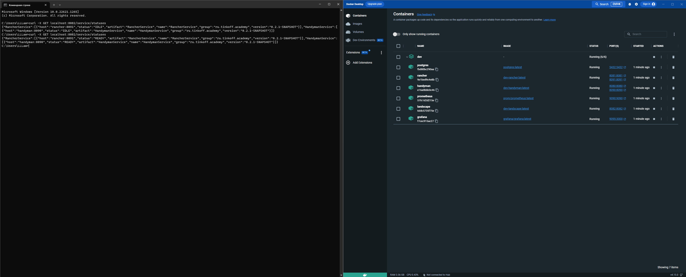

# Инструкция по запуску docker:
0. В dev/environment/<название сервиса> создать файл .env с переменными окружения из соответствующих сервисов и для
   postgres, grafana.
1. `cd dev`
2. `docker-compose build`
3. `docker-compose up -d`
4. [Инструкция](../monitoring/readme.md) для просмотра метрик в grafana

# Инструкция по запуску в minikube:

0. В dev/kube создать необходимые secret-файлы <название сервиса>-env.yml с переменными окружения из соответствующих
   сервисов и для postgres.
1. `minikube start`
2. `eval $(minikube docker-env)`
3. `DOCKER_BUILDKIT=1 docker build -t <handyman | rancher | landscape> .` в корне каждого сервиса.
4. `cd dev`
5. `kubectl apply -f kube`
